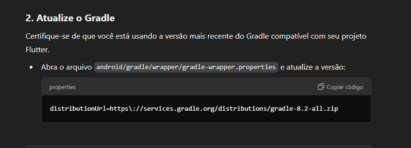
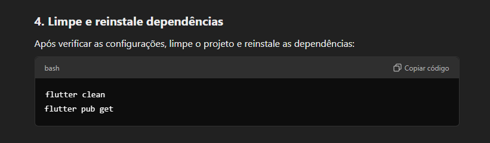
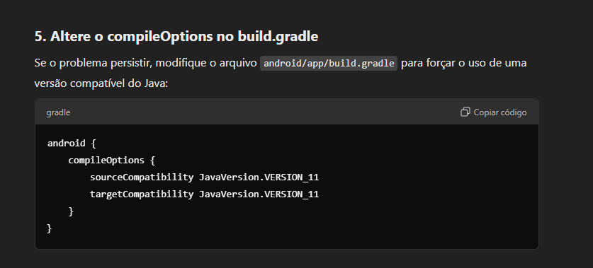
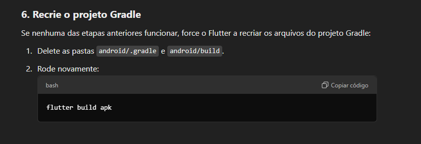

# Flutter-Estudos

## Links:
### 1) Instalação: [https://docs.flutter.dev/get-started/install/windows/web](https://docs.flutter.dev/get-started/install/windows/web)
### 2) Atualização flutter: [https://docs.flutter.dev/release/upgrade](https://docs.flutter.dev/release/upgrade)
### 3) Desinstalar flutter: [https://docs.flutter.dev/get-started/uninstall?tab=Windows](https://docs.flutter.dev/get-started/uninstall?tab=Windows)
### 4) Deployment Flutter: [https://docs.flutter.dev/deployment](https://docs.flutter.dev/deployment)
 

## Ambiente:
### 1) Local de instalação Flutter:`%USERPROFILE%\Documents\flutter\\{FLUTTER_VERSION}\`
### 2) Variável de ambiente à configurar: `%USERPROFILE%\Documents\flutter\\{FLUTTER_VERSION}\bin\`
### 3)Local de instalação SDK do ANDROID: `%USERPROFILE%\AppData\Local\Android\Sdk`

## Comandos Flutter
### 1) Olhar se o flutter foi instalando/configurado corretamente: `flutter doctor`
### 1.1) Olhar se o flutter foi instalando/configurado corretamente com mais detalhes: `flutter doctor -v`
### 1.2) Instala/Atualiza licenças do android pendentes: `flutter doctor --android-licenses`
### 2) Atualizar flutter SDK: `flutter upgrade`
### 3) Visualizar canal habilitado: `flutter channel``
### 4) Atualizar/instalar pacotes e validart `pubspec.yaml`: `flutter pub get`
### 5) Gerar versão de release da apk android: `flutter build apk`
### 5) Gerar versão de release da apk android (Processo para enviar para loja da google): `flutter build appbundle`

## Pacotes úteis
### 1) [https://pub.dev/packages/flutter_launcher_icons](https://pub.dev/packages/flutter_launcher_icons)

## Problemas comum de execução:

### 1) Error referente ao gradle: `compileDebugJavaWithJavac`

Link útel para resolução do problema: [https://github.com/flutter/flutter/issues/156304#issuecomment-2397707812](https://github.com/flutter/flutter/issues/156304#issuecomment-2397707812)